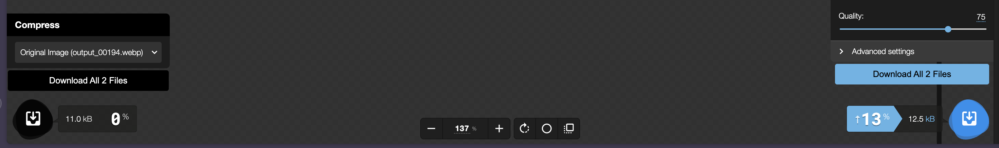

# THIS IS A FORK

This fork supports multiple files export. The rest is the same.

## Exporting Multiple Files

When you select more than 1 files, you will see two buttons for downloading multiple files, one for each of the side.

Clicking on either of them download your images with settings of that side.



# [Squoosh]!

[Squoosh] is an image compression web app that reduces image sizes through numerous formats.

# Privacy

Squoosh does not send your image to a server. All image compression processes locally.

However, Squoosh utilizes Google Analytics to collect the following:

- [Basic visitor data](https://support.google.com/analytics/answer/6004245?ref_topic=2919631).
- The before and after image size value.
- If Squoosh PWA, the type of Squoosh installation.
- If Squoosh PWA, the installation time and date.

# Developing

To develop for Squoosh:

1. Clone the repository
1. To install node packages, run:
   ```sh
   npm install
   ```
1. Then build the app by running:
   ```sh
   npm run build
   ```
1. After building, start the development server by running:
   ```sh
   npm run dev
   ```

# Contributing

Squoosh is an open-source project that appreciates all community involvement. To contribute to the project, follow the [contribute guide](/CONTRIBUTING.md).

[squoosh]: https://squoosh.app
